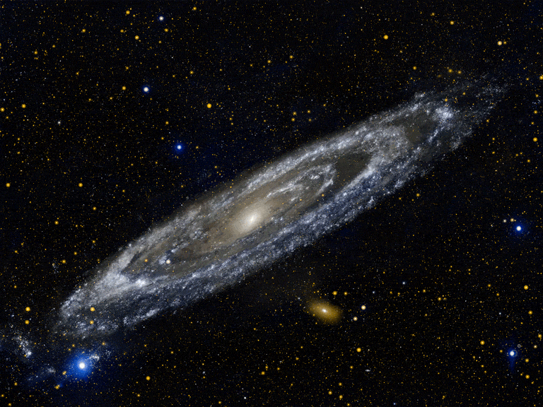

# Exoplanet Hunting Using Machine Learning and NASA Database

## *Work in progress*

### What is the Exoplanets?

Exoplanets are planets beyond our own solar system. Thousands have been discovered in the past two decades, mostly with NASA's Kepler Space Telescope.

These exoplanets come in a huge variety of sizes and orbits. Some are gigantic planets hugging close to their parent stars; others are icy, some rocky. NASA and other agencies are looking for a special kind of planet: one that’s the same size as Earth, orbiting a sun-like star in the habitable zone.

The habitable zone is the area around a star where it is not too hot and not too cold for liquid water to exist on the surface of surrounding planets. 

Scientists discovered a very efficient way to study these occurrences; planets themselves do not emit light, but the stars around which they orbit do. Considering this fact into account scientists at NASA developed a method which they called Transit method in which a digital-camera-like technology is used to detect and measure tiny dips in a star’s brightness as a planet crosses in front of the star. With observations of transiting planets, astronomers can calculate the ratio of a planet’s radius to that of its star — essentially the size of the planet’s shadow — and with that ratio, they can calculate the planet’s size.
Kepler Space Telescope’s primary method of searching for planets was the “Transit” method.

Source: https://exoplanets.nasa.gov/
